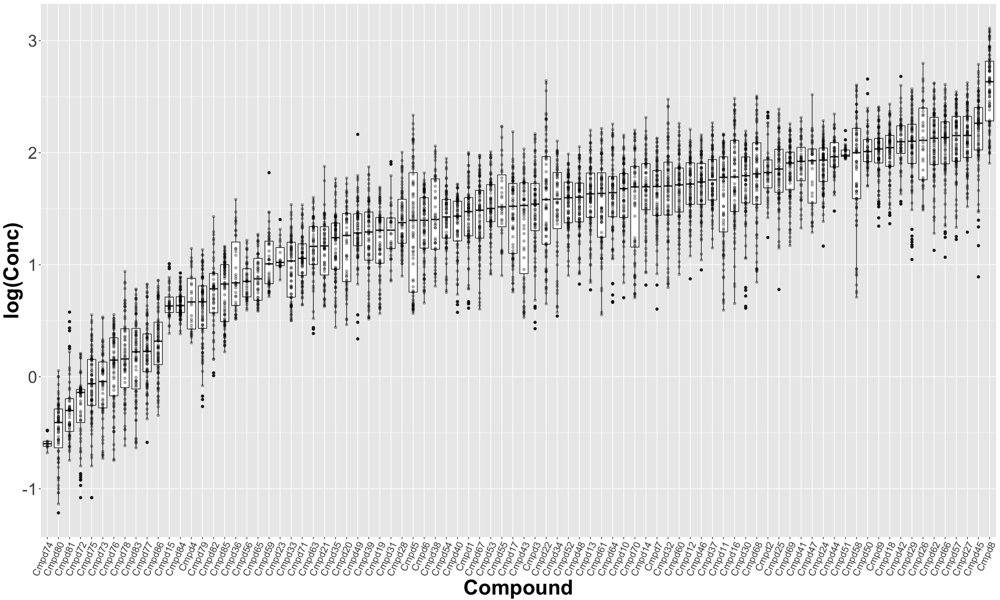
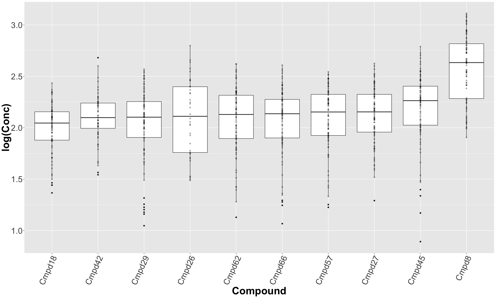

# DataViz for High-dimensional Environmental Data  #1

## A Hack to get Top-10 Boxplots using `ggplot2` in R

Let's say I'm working on a fairly large dataset consisting of:

 * ~100 chemical compounds measured at
 * \>10 sampling timepoints,
 * \> 10 geographical sampling locations,
 * and their respective concentration values at each location and timepoint.


In practice, the data look something like this:


```R
df <- read.csv("data_anon_20210217.csv",header=T)
str(df)
head(df)
```

    'data.frame':	6211 obs. of  6 variables:
     $ Compound : Factor w/ 86 levels "Cmpd1","Cmpd10",..: 1 1 1 1 1 1 1 1 1 1 ...
     $ Location : Factor w/ 13 levels "Loc1","Loc10",..: 1 7 10 12 1 5 13 4 1 3 ...
     $ Time     : Factor w/ 11 levels "Apr 2019","Apr 2020",..: 1 10 11 3 2 9 11 9 8 7 ...
     $ Conc_ng.L: num  39.1 97.6 21.5 68.2 28.7 ...
     $ logConc  : num  1.59 1.99 1.33 1.83 1.46 ...
     $ Mode     : Factor w/ 2 levels "neg","pos": 2 2 2 2 2 2 2 2 2 2 ...


<table>
<caption>A data.frame: 6 × 6</caption>
<thead>
	<tr><th scope=col>Compound</th><th scope=col>Location</th><th scope=col>Time</th><th scope=col>Conc_ng.L</th><th scope=col>logConc</th><th scope=col>Mode</th></tr>
	<tr><th scope=col>&lt;fct&gt;</th><th scope=col>&lt;fct&gt;</th><th scope=col>&lt;fct&gt;</th><th scope=col>&lt;dbl&gt;</th><th scope=col>&lt;dbl&gt;</th><th scope=col>&lt;fct&gt;</th></tr>
</thead>
<tbody>
	<tr><td>Cmpd1</td><td>Loc1 </td><td>Apr 2019</td><td>39.09086</td><td>1.5920752</td><td>pos</td></tr>
	<tr><td>Cmpd1</td><td>Loc3 </td><td>Oct 2019</td><td>97.61118</td><td>1.9894996</td><td>pos</td></tr>
	<tr><td>Cmpd1</td><td>Loc6 </td><td>Sep 2019</td><td>21.52053</td><td>1.3328530</td><td>pos</td></tr>
	<tr><td>Cmpd1</td><td>Loc8 </td><td>Aug 2019</td><td>68.15322</td><td>1.8334864</td><td>pos</td></tr>
	<tr><td>Cmpd1</td><td>Loc1 </td><td>Apr 2020</td><td>28.71672</td><td>1.4581348</td><td>pos</td></tr>
	<tr><td>Cmpd1</td><td>Loc13</td><td>May 2020</td><td> 6.16799</td><td>0.7901437</td><td>pos</td></tr>
</tbody>
</table>


As a *first step*, I want to gain a *broad overview of the range of concentration values* measured for *each compound across all sampling locations and timepoints*.


One relatively simple way of visualising ranges is to plot the concentrations as **boxplots**, one for each compound.

Here I've plotted them in ascending order of median log(Concentration).


```R
suppressWarnings(suppressMessages(library("ggplot2")))
options(repr.plot.width=20, repr.plot.height=12)
bp <- ggplot(df, aes(x=reorder(Compound,logConc, FUN=median),y=logConc)) +
xlab("Compound") + ylab("log(Conc)") + geom_boxplot() + geom_point(alpha=0.3) +
theme(axis.text.x = element_text(size=14, angle=65, hjust=1),axis.text.y = element_text(size=24)) +
theme(axis.title.x = element_text(face="bold", size=30), axis.title.y = element_text(face="bold",size=30))  
```


```R
bp
```





### Looks pretty busy, doesn't it?

While it gives a decent overview of the concentration *ranges* across all compounds, there are simply too many compounds to visualise meaningfully in one plot - no amount of fiddling with plotting parameters will change the fact that we have to squeeze so many boxes into one plot.

I think this problem is a hallmark of **high-dimensional environmental data**, and plotting them will always be a challenge...

But for now:


## What if I just want to see the Top 10 Compounds?

In other words, Compounds whose median logConc are the Top 10 highest.

Typically most people would just sort their median logConc in descending order, subset the first x rows of their data frame, and plot these.

However, I can't do that.

If we revisit the `df`, you'll notice that I did not precalculate and store any of the median logConc values:


```R
head(df)
```


<table>
<caption>A data.frame: 6 × 6</caption>
<thead>
	<tr><th scope=col>Compound</th><th scope=col>Location</th><th scope=col>Time</th><th scope=col>Conc_ng.L</th><th scope=col>logConc</th><th scope=col>Mode</th></tr>
	<tr><th scope=col>&lt;fct&gt;</th><th scope=col>&lt;fct&gt;</th><th scope=col>&lt;fct&gt;</th><th scope=col>&lt;dbl&gt;</th><th scope=col>&lt;dbl&gt;</th><th scope=col>&lt;fct&gt;</th></tr>
</thead>
<tbody>
	<tr><td>Cmpd1</td><td>Loc1 </td><td>Apr 2019</td><td>39.09086</td><td>1.5920752</td><td>pos</td></tr>
	<tr><td>Cmpd1</td><td>Loc3 </td><td>Oct 2019</td><td>97.61118</td><td>1.9894996</td><td>pos</td></tr>
	<tr><td>Cmpd1</td><td>Loc6 </td><td>Sep 2019</td><td>21.52053</td><td>1.3328530</td><td>pos</td></tr>
	<tr><td>Cmpd1</td><td>Loc8 </td><td>Aug 2019</td><td>68.15322</td><td>1.8334864</td><td>pos</td></tr>
	<tr><td>Cmpd1</td><td>Loc1 </td><td>Apr 2020</td><td>28.71672</td><td>1.4581348</td><td>pos</td></tr>
	<tr><td>Cmpd1</td><td>Loc13</td><td>May 2020</td><td> 6.16799</td><td>0.7901437</td><td>pos</td></tr>
</tbody>
</table>


Instead, I calculated and ordered the median values "in situ" within the `aes` argument of `ggplot2`.

This strategy was deliberate; I wanted to keep my `df` lean because I planned to generate multiple views of the data by calculating and plotting multiple median concentration values across different variables e.g.

* sampling location
* sampling timepoint
* selected locations/timepoints respectively, *etc*

If I had calculated and stored the median values for each, I would have had more and more columns in my already large `df`.

So to avoid bloating my data frame (or generating multiple additional data frames), calculating the median values within the `ggplot` call seemed the most elegant strategy.

The downside now of course, is that I can't just sort and subset my data to plot the Top-10 (and googling "ggplot display top 10 boxplots", "subset ggplot boxplots", and variations thereof yielded nothing.)


## Hacking `ggplot` using `ggplot_build`


What if we just subset the dataset by the Compound names running on the x-axis?
>find the names of the first 10 compounds going from right to left and just plot these!


One can of course do this manually when working with just 10, but like most programmers I'm pretty lazy. (Also, what if we eventually want to plot the top 100? top 200? Not to mention how error-prone humans are.)


So, since #GIYBF, I searched something like "ggplot extract axis tick labels".

I suspected that somewhere in all the internal plotting magic of the `ggplot` call, there had to be some intermediate dataset between what I input as the `data` argument of `ggplot`, and what actually shows up in the plot object.

[*Hey presto!*](https://stackoverflow.com/questions/31223818/accessing-vector-of-axis-ticks-for-an-existing-plot-in-ggplot2)    #SOIYBF

Behold `ggplot_build()`:


```R
ggbld <- ggplot_build(bp)
compounds_sorted_ascending_medianlogConc <- ggbld$layout$coord$labels(ggbld$layout$panel_params)[[1]]$x.labels
```


```R
top10_medians_percompound <- df[df$Compound %in% compounds_sorted_ascending_medianlogConc[77:86], ]
```


```R
ggplot(top10_medians_percompound, aes(x=reorder(Compound,logConc, FUN=median),y=logConc)) +
xlab("Compound") + ylab("log(Conc)") + geom_boxplot() + geom_point(alpha=0.3) +
theme(axis.text.x = element_text(size=24, angle=65, hjust=1),axis.text.y = element_text(size=24)) +
theme(axis.title.x = element_text(face="bold", size=30), axis.title.y = element_text(face="bold",size=30))  
```





In a few lines of code, I was able to 'visually subset' my boxplots without having to compromise the deliberate leanness of my original data frame.

My strategy to keep the `df` lean (have minimum no. columns) arose as I knew I wanted to generate multiple plots of different median values calculated across different variables within the same dataset.

Curious to know what approach you would have taken - leave a comment!


### Last thoughts

Are boxplots really the best way to visualise such environmental concentration data? Do concepts of IQ range and outliers make sense?

What other plots besides boxplots are well suited for visualising **high-dimensional environmental data**? Static vs. interactive options?

That's what I hope to continue exploring in this series!

[](https://hits.seeyoufarm.com)
